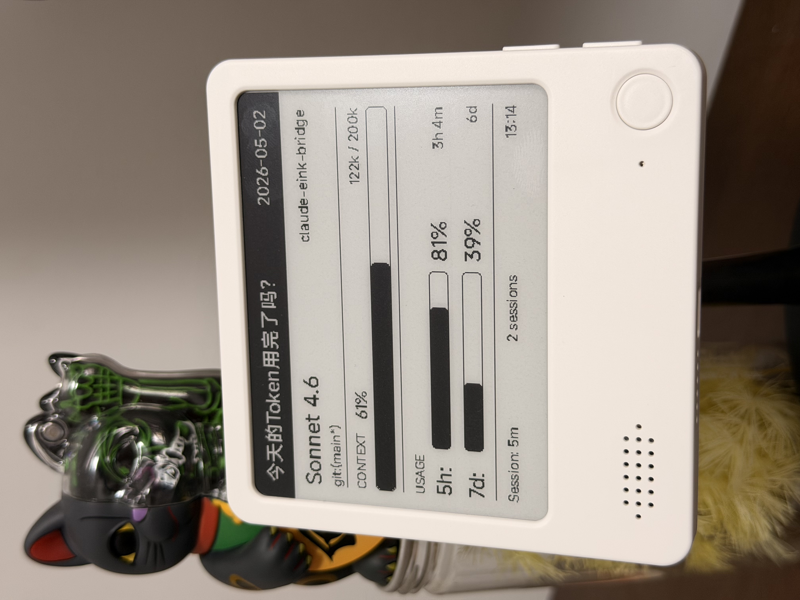
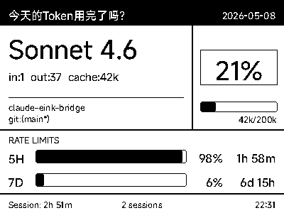

# Claude Code E-Ink HUD - E-Ink Desktop Dashboard

[中文](./README.md)

This project is a hardware extension bridge for [Claude HUD](https://github.com/jarrodwatts/claude-hud). It seamlessly syncs your real-time status while using [Claude Code](https://docs.anthropic.com/en/docs/agents-and-tools/claude-code/overview) (Token consumption, current model, context occupancy, etc.) to your **Zectrix E-Ink display**, creating a geeky physical AI dashboard for your desk.



*(Photo shows the device in action. Note: This project currently supports macOS only)*

## ✨ Features

- **Stealth Background Operation**: Completely non-intrusive design that doesn't modify original code. It wakes up as a "shadow component" when you open Claude Code and automatically destroys itself 10 minutes after closing the terminal, fully releasing background resources.
- **Geek-Level Performance Optimization (Zero-burden for Mac)**:
  - **Zero SSD Wear**: Image rendering is done entirely in memory streams, avoiding frequent generation of temporary image files on your hard drive.
  - **Strong Anti-Spam**: Built-in 30-second disk cooling and Hash interceptor. No matter how fast the AI generates text, it won't trigger an I/O storm, and network requests are only made when data changes (approx. 2KB bandwidth each).
- **Multiple-Instance Tracking**: Running Claude Code in several terminals? No problem. It automatically scans and tracks the most recently active project.

---

## 📂 Core Project Files

If you want to explore or develop further, here's what each file does:
- `install.sh` / `install.command`: One-click lightning installation scripts for Mac users.
- `eink-wrapper.ts`: The core interceptor responsible for "eavesdropping" on Claude's internal status.
- `setup-eink.mjs`: Underlying configuration script for the installer, binding the interceptor to Claude.
- `main.py`: Python rendering program that draws data into images and pushes them to the Zectrix E-Ink display.
- `preview.png`: The demo image used at the top of this documentation.
- `font.ttf`: Open-source MiSans font file used for rendering text in Python.
- `config.example.json`: Default configuration file template.

---

## 📊 Dashboard Information & Layout



- **Top Status Bar**: Customizable greeting (default: "Token exhausted yet?") and the last update date.
- **Project & Model Info**: Current model name (e.g., `Claude 3.6 Sonnet`), current project folder name, and Git branch status (shows `*` if there are uncommitted changes).
- **Context Health (CONTEXT)**: Visual progress bar showing context occupancy with precise Token consumption (e.g., `12k / 200k`). Warnings appear when the context is nearly full.
- **API Quota Usage (USAGE)**: Progress bars for API quota usage over the last 5 hours and 7 days. Most importantly, it shows a **countdown** to quota reset (e.g., `2h15m`), letting you know exactly when you'll be back to full power.
- **Bottom Status Bar**: Shows the duration of the current session, whether multiple terminals are running, and the current clock.

---

## 🛠️ Installation Preparation (One-time)

### Prerequisites
Before installing, ensure your computer has the following tools:
1. **[Claude Code](https://docs.anthropic.com/en/docs/agents-and-tools/claude-code/overview)**.
2. **[Claude HUD](https://github.com/jarrodwatts/claude-hud)**: The original graphical dashboard. Ensure it's working properly first.
3. **[Node.js](https://nodejs.org/)** and **[Python 3](https://www.python.org/downloads/)**: Required environments for running scripts.

### One-Click Installation (Recommended)
No need to download source code or find folders. Just open your Mac's **Terminal**, paste the command below, and press Enter:

```bash
curl -fsSL https://raw.githubusercontent.com/answer24/claude-eink-bridge/main/install.sh | bash
```

**This command automatically handles everything in the background:**
1. Downloads code to `~/.claude-eink-bridge`.
2. Configures the interceptor and dependencies.
3. Generates a default configuration file.

Once the terminal shows `🎉 Lightning installation complete!`, a **text editor window will automatically pop up** with the `config.json` file (if not, you can manually run `open ~/.claude-eink-bridge/config.json` or open it with VSCode).

---

## ⚙️ Binding E-Ink (Zectrix Platform Config)

You need to obtain parameters from the Zectrix cloud platform. Log in here: **https://cloud.zectrix.com/**

In `config.json`, fill in three key parameters: `api_key`, `mac_address`, and `page_id`.

### 1. Get API Key (`api_key`)
- Click **Open API** on the left side of the Zectrix platform.
- Click "Create API Key", copy the generated code, and replace `"YOUR_ZECTRIX_API_KEY"` in `config.json`.

### 2. Get Device MAC Address (`mac_address`)
- Click **Device Management** on the left side, find your E-Ink display, copy its MAC address, and paste it into `config.json`.

### 3. Set Page ID (`page_id`)
E-Ink displays can have multiple pages. Since pushes overwrite existing pages, you must specify which page to use:
- The default `page_id` is `5`, meaning it will overwrite the 5th page of your display.
- If you usually use the first 3 pages, or want it on page 1, change `page_id` in `config.json` (Note: enter as a number, no quotes).

**Your final `config.json` should look like this:**
```json
{
  "api_key": "sec_1234567890abcdef",
  "mac_address": "A1:B2:C3:D4:E5:F6",
  "page_id": 5,
  "interval_seconds": 60,
  "greeting": "Token exhausted yet?",
  "font_path": "font.ttf"
}
```

> **💡 Tip:** For the best experience, set your device's "Polling Interval" to **1 minute** in the Zectrix backend and keep `interval_seconds` at **60** in `config.json`.

---

## 🚀 Getting Started

Simply type `claude` in your terminal to use Claude Code as usual. After a few seconds, your E-Ink display will automatically refresh with the cool real-time dashboard!

When you finish work and close all Claude Code processes, the background service will automatically exit after 10 minutes.

---

## ❓ FAQ & Troubleshooting

**Q: I've configured everything, but the screen won't refresh?**
A: You can troubleshoot manually. Open your terminal and run:
```bash
cd ~/.claude-eink-bridge
source .venv/bin/activate
python main.py --preview
```
This generates a `preview-local.png` file. If it doesn't appear or an error occurs, check your config or network. If it generates but the screen doesn't change, your API Key or MAC address might be wrong.

**Q: Changes aren't taking effect after updating project code?**
A: This is normal. Claude Code actually runs the file copied to `~/.claude/eink-wrapper.ts`, not the one in the project directory. After pulling new code, re-run the installation command:
```bash
curl -fsSL https://raw.githubusercontent.com/answer24/claude-eink-bridge/main/install.sh | bash
```
The script will skip existing venv and config, only updating the interceptor file.

**Q: How do I apply configuration changes (e.g., greeting, font) immediately?**
A: The program runs silently in the background and doesn't monitor config changes in real-time. You need to force-close it first:
```bash
pkill -f main.py
```
It's normal if there's no output. Then, just type `claude` in any terminal to wake the agent, and it will restart with your new configuration!

**Q: How do I uninstall and restore original settings?**
A: Run this command to unbind from Claude Code:
```bash
node ~/.claude-eink-bridge/setup-eink.mjs --undo
```

**Q: Why do I need a font file if it's pushing images?**
A: While the final output is an image, it is rendered locally on your computer. To convert Claude's "text data" into an "image," the program needs `font.ttf` to know how to draw characters.
We've included **Xiaomi's MiSans (Medium)** font, which is exceptionally clear on E-Ink displays and free for public/commercial use.

**Q: Can I customize the top greeting?**
A: Yes! Open `~/.claude-eink-bridge/config.json` and change the `greeting` text. For best results, keep it under 12 Chinese characters or 25 English letters. Longer text will be truncated with `...`.

**Q: Can I use a different font?**
A: Just place your desired `.ttf` font file in `~/.claude-eink-bridge`, rename it to `font.ttf`, and overwrite the existing one (or change `font_path` in `config.json`). Try your favorite retro pixel font!

---

## 📺 Follow Us

If this tool helped you or made your desk cooler, **follow us on Bilibili!**

- 🔲 **[极趣实验室 (Hardware Official)](https://space.bilibili.com/13131424)**: The creators of the cool Zectrix E-Ink display!
- 👨‍💻 **[最近使用 (Project Author)](https://space.bilibili.com/217963572)**: Subscribe for more Apple ecosystem and AI productivity tools!
